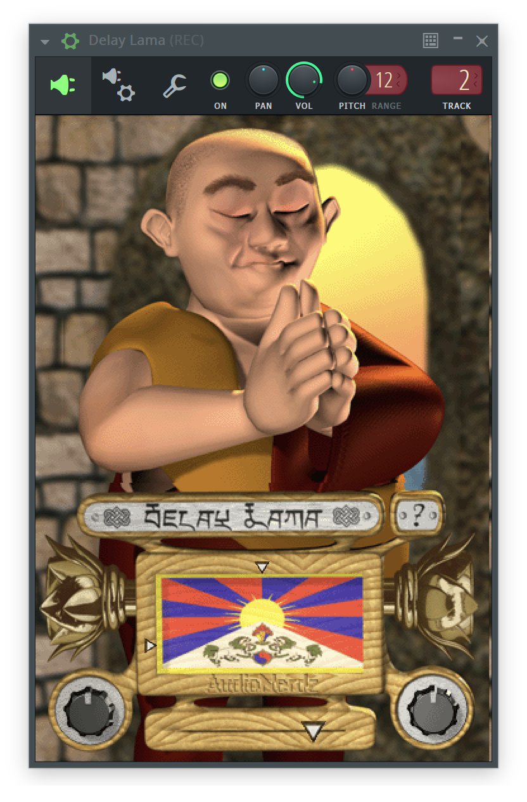

# Delay Lama



**Delay Lama** is a monophonic vocal synthesizer rebuilt in Rust from the AudioNerdz plug-in. Play MIDI or the XY pad: horizontal movement controls pitch; vertical movement controls vowel. Host parameters: Vowel, Portamento, Delay, and Voice.

## Formats and platforms

| Platform | Release architectures | Formats |
| --- | --- | --- |
| Windows | x86_64, ARM64 | CLAP, VST3, LV2 |
| Linux | x86_64, ARM64 | CLAP, VST3, LV2 |
| macOS | Apple Silicon + Intel, universal | CLAP, VST3, LV2, AUv2, AUv3 |
| iOS / iPadOS | ARM64 device and simulator | AUv3 |

Linux builds use Ubuntu 24.04 and need X11 (or XWayland) and Vulkan. 32-bit targets, Android, BSD, and other UNIX ports are not supported. iOS device builds require provisioning; simulator builds do not.

## Install

Extract the release archive or open the macOS DMG. Copy the format your DAW uses to its plug-in folder, then rescan:

| Platform | Plug-in folders |
| --- | --- |
| Windows | `%COMMONPROGRAMFILES%\CLAP`, `%COMMONPROGRAMFILES%\VST3`, `%APPDATA%\LV2` |
| Linux | `~/.clap`, `~/.vst3`, `~/.lv2` |
| macOS | `~/Library/Audio/Plug-Ins/{CLAP,VST3,LV2,Components}` |

For AUv3, copy `Delay Lama.app` to `/Applications` and open it once before rescanning your DAW. Windows and Linux archives are unsigned; the macOS DMG is signed and notarized by the release workflow.

## Build

Install Rust through rustup (`rust-toolchain.toml` pins the version). Build from the repository root. Prerequisites:

- **Windows:** Visual Studio Build Tools with Desktop development with C++ and the Windows SDK. Use the MSVC Rust toolchain.
- **Linux:** a C/C++ toolchain, pkg-config, ALSA and X11 development libraries. On Ubuntu:

  ```sh
  sudo apt-get install build-essential pkg-config libasound2-dev libx11-dev libx11-xcb-dev libxcb1-dev libxcursor-dev libxrandr-dev libxi-dev libgl1-mesa-dev libvulkan1
  ```

- **macOS/iOS:** Xcode Command Line Tools; full Xcode and Python 3.11+ for AUv3, iOS, and universal packaging.

Build desktop CLAP, VST3, and LV2:

```sh
cargo install cargo-truce --version 6.3.0 --locked
cargo truce build -p xymonk --clap --vst3 --lv2 --target-cpu baseline
```

Bundles go to `target/bundles/`; nothing is installed. `baseline` avoids requiring AVX2 on x86_64.

With `just` and a POSIX shell (Git Bash on Windows), `just rust-install vst3` builds and installs VST3 per-user, loading `.env` when present. Windows installs go to `%LOCALAPPDATA%\Programs\Common\VST3`; add that folder to the DAW's scan paths if needed. See [justfile](justfile) for other formats and commands.

For macOS AUv2, use `cargo truce build -p xymonk --au2 --target-cpu baseline`. For AUv3:

```sh
python3 scripts/auv3.py
python3 scripts/auv3.py --universal-package
```

The second command builds all five formats in `target/universal-bundles/` and an installer in `target/dist/`. Local builds are not notarized. Keep signing values in ignored `.env`; see [.env.example](.env.example).

For development AUv3 registration, set `AUV3_SIGNING_IDENTITY` to an Apple Development certificate, then run `just install-auv3-dev` and `just verify-auv3-registration`.

### iOS

On macOS with full Xcode, build a device/simulator development library:

```sh
rustup target add aarch64-apple-ios aarch64-apple-ios-sim
cargo truce package --ios --xcframework -p xymonk
```

Output: `target/ios/xcframework/`, not an installable app. With a booted ARM64 simulator, `cargo truce install --ios -p xymonk` builds and installs the AUv3 container.

## Release signing

[.env.example](.env.example) documents all signing inputs. Configure ignored `.env.release`, then explicitly confirm upload:

```sh
python3 scripts/setup_release_secrets.py configure --platform ios
python3 scripts/setup_release_secrets.py apply --platform ios
```

Use `--platform macos` for desktop signing. Configuration preserves the other platform's entries. For iOS, provide an Apple Distribution `.p12` and four profiles: app and AUv3 extension for both Ad Hoc and App Store Connect. Press Enter at the password prompt to retain your existing `IOS_CERTIFICATE_PASSWORD`. No secret is uploaded by `configure`.

The main-only Release workflow creates the version tag, uploads all platform packages and `SHA256SUMS`, verifies the uploaded files, and publishes the release. It can resume an unfinished draft, but refuses to replace a published release or move an existing tag. Select `ios_distribution` to include an Ad Hoc or TestFlight-signed IPA; it never uploads to Apple. Ad Hoc requires registered devices. TestFlight signing alone does not establish upload readiness: app icons, App Store Connect metadata, and Apple validation remain required.

## Contributing

See [CONTRIBUTING.md](CONTRIBUTING.md) for checks and [CODE_OF_CONDUCT.md](CODE_OF_CONDUCT.md) for participation rules.

## License

This software is provided free of charge and may be distributed freely, as long as all the files are distributed along with the plugin file. It may not be sold or included in any commercial package, nor used as part of any commercial promotion. Contact AudioNerdz if you wish to include it on a CD collection.
